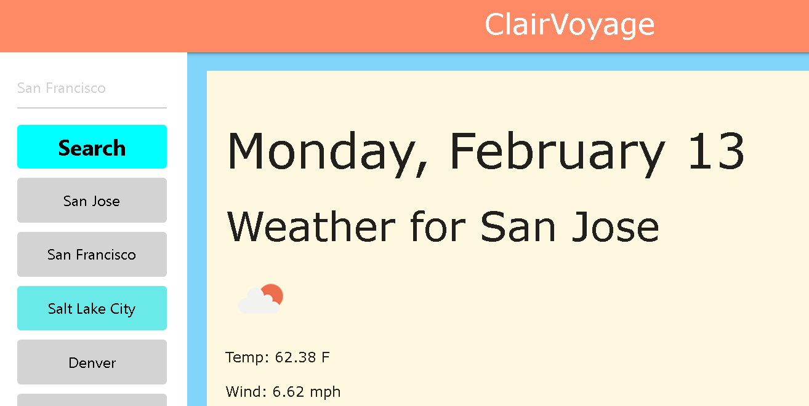

# <meteorological-clairvoyance>

## Description

It lets your computer see the future. Unfortunately, all it can see is the weather.

The main motivation for attempting this project was to get extra practice using third-party APIs and libraries to accentuate my work. It was interestign to mesh DayJS with the Weather API, and dynamically present information based on a user's input that can actually be useful in their real lives (although, I know better/cleaner/established services for looking up weather information already exist).

The main thing I learned is that third party libraries can only take you so far. Materialize, while very easy to use and professional looking in general, had very little in the way of cosmetically adjusting the page via color and positioning, although the grid system was very helpful.

## Usage

Deployed page: [here](https://valjean451.github.io/meteorological-clairvoyance)

Search a city name and be presented with the current weather, along with a 5 day forecast! Past searches will be stored on the left sidebar for future use.

## Credits

I used several third party libraries to accomplish this project: 
[JQuery](https://jquery.com/)
[MaterializeCSS](https://materializecss.com/)
[Weather API](https://openweathermap.org/api)
[DayJS](https://day.js.org/)

## License

Please refer to the license in the repository.